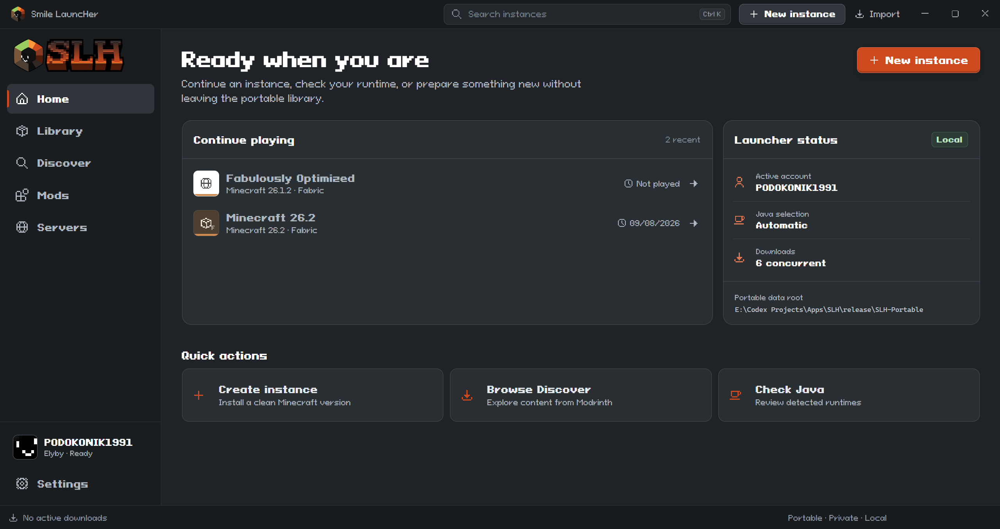
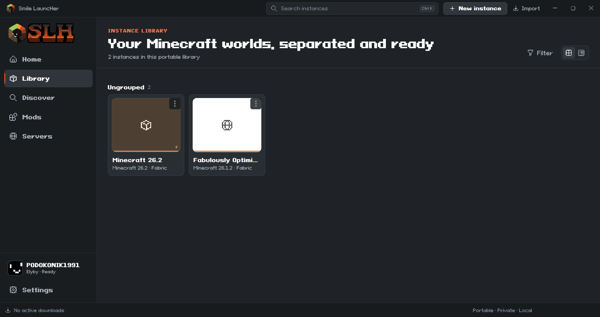
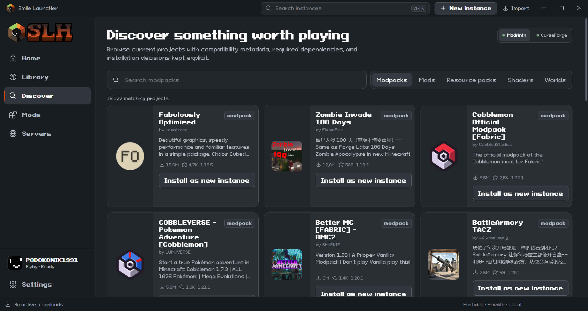
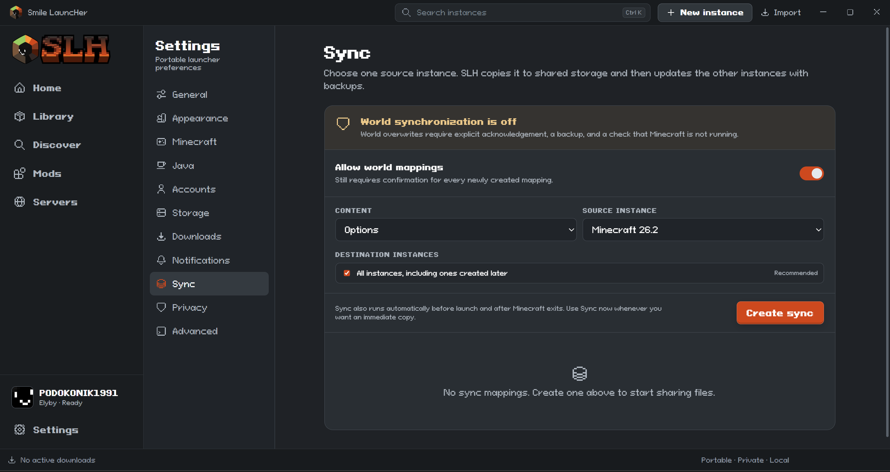

<p align="center">
  
</p>

<h1 align="center">"W.I.P." Smile LauncHer</h1>

<p align="center">
  A modern, open-source Minecraft: Java Edition launcher for Windows.
</p>

<p align="center">
  
  
  
  
</p>

<p align="center">
  <a href="#features">Features</a> •
  <a href="#screenshots">Screenshots</a> •
  <a href="#download">Download</a> •
  <a href="#building-from-source">Build from source</a>
</p>

---

<p align="center">
  
</p>

## About

**Smile LauncHer (SLH)** is an open-source Minecraft: Java Edition launcher focused on powerful instance management, customization, modding and a clean desktop experience.

SLH is currently developed primarily as a **portable Windows x64 launcher**.

## Features

- Multiple isolated Minecraft instances
- Grid and list instance views with custom groups
- Microsoft, Ely.by and Offline accounts
- Vanilla, Fabric, Forge, NeoForge and Quilt support
- Modrinth and CurseForge integration
- Built-in mod and modpack management
- Java detection and management
- Cross-instance synchronization for selected Minecraft files and settings
- Full launcher color customization
- Dark interface with the SLH color system
- Portable Windows build
- English interface with localization support prepared for additional languages

## Screenshots

### Instance management

<p align="center">
  
</p>

Manage an instance, its mods, worlds, screenshots, settings and logs from one place.

### Discover

<p align="center">
  
</p>

Browse compatible Minecraft content directly from supported platforms.

### Customization

<p align="center">
  
</p>

Customize the launcher colors and configure synchronization between instances.

## Accounts

SLH supports:

- **Microsoft** accounts
- **Ely.by** accounts
- **Offline** accounts

Account credentials and authentication data should never be committed to this repository.

## Download

SLH is still in development.

When public builds are available, download the latest portable version from:

**[GitHub Releases](https://github.com/gareldd/slh/releases)**

Portable builds do not require a traditional installer.

## Building from source

Development instructions will be expanded as the project matures.

The project uses a desktop application architecture built around Tauri, a modern frontend, and a Rust launcher backend.

Clone the repository:

```bash
git clone https://github.com/gareldd/slh.git
cd slh
```

Then follow the development documentation included in the repository.

## Project status

SLH is under active development. Features, APIs, UI details and internal formats may change before the first stable release.

If you find a bug or have a suggestion, open an issue:

**[GitHub Issues](https://github.com/gareldd/slh/issues)**

## License

This project is licensed under the **MIT License**.

See [LICENSE](LICENSE) for details.

---

<p align="center">
  
</p>

<p align="center">
  <b>Smile LauncHer</b><br>
  Open-source Minecraft launcher.
</p>
