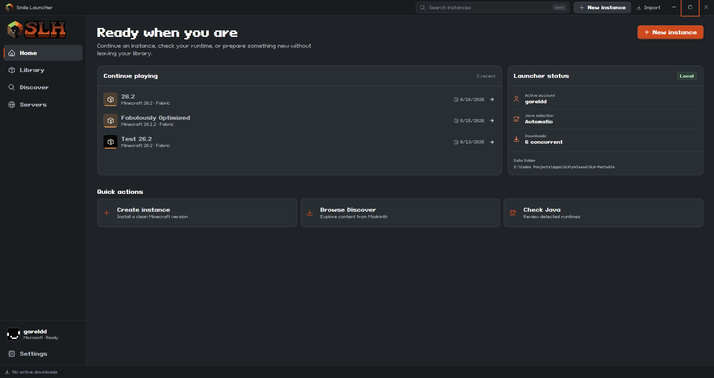
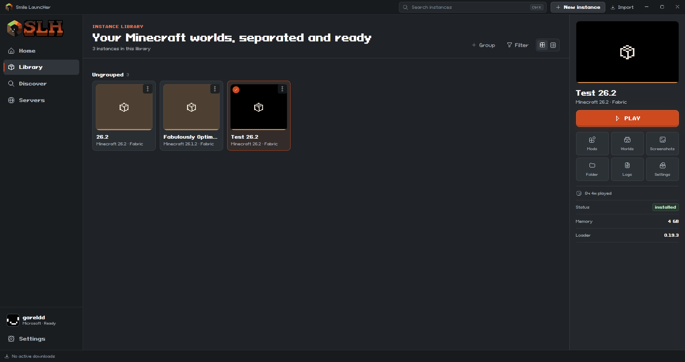
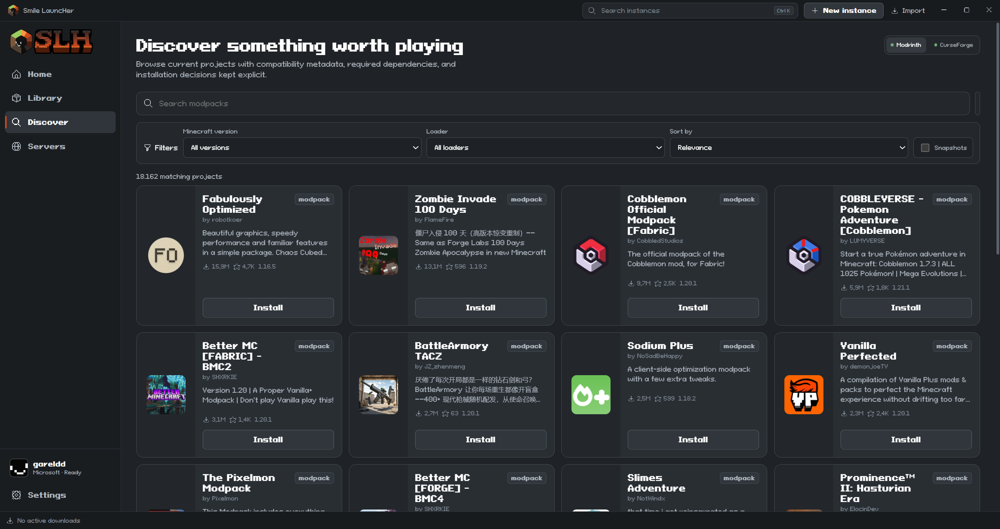
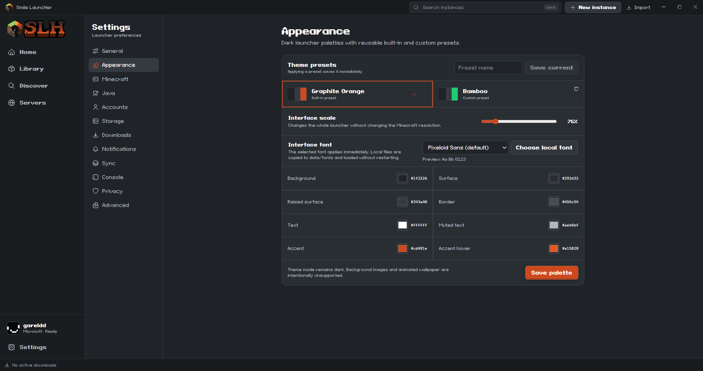
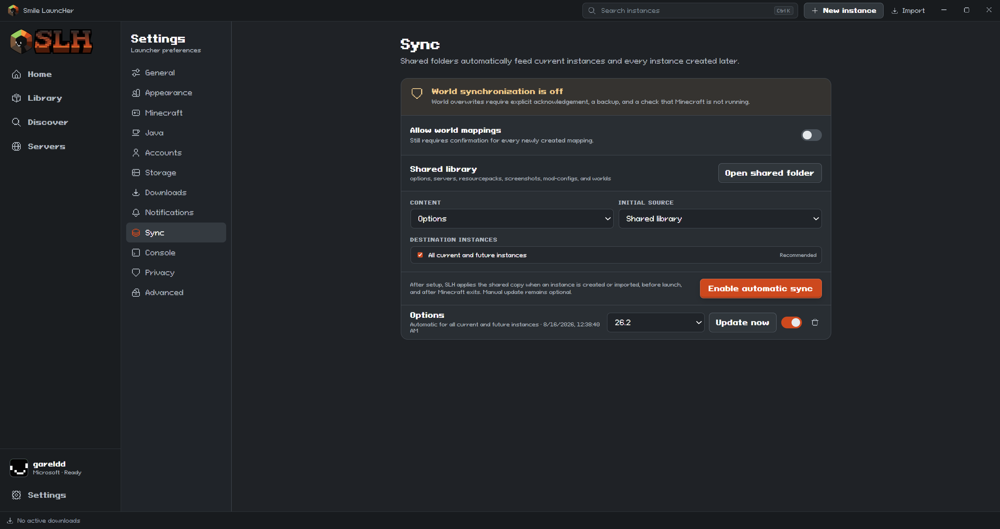
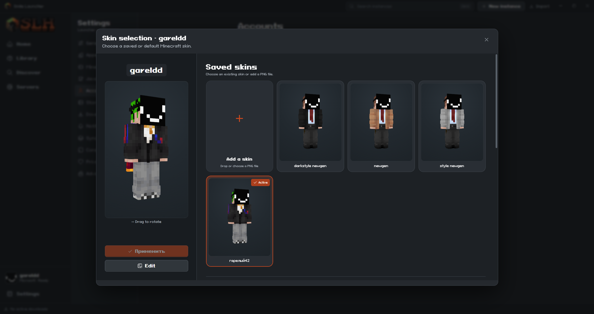
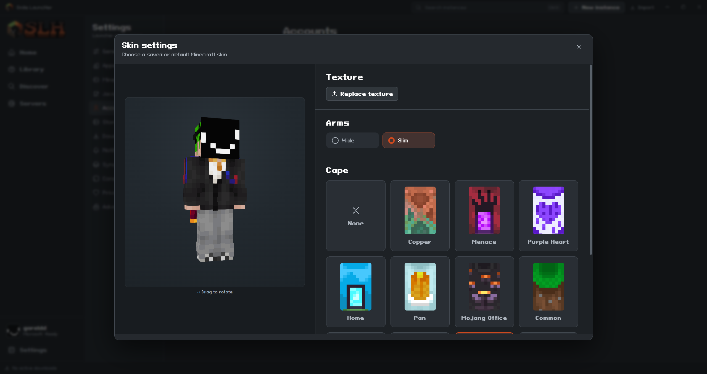

<p align="center">
  
</p>

# Smile LauncHer

Локальный лаунчер Minecraft: Java Edition для Windows.

**Языки:** [English](README.md) · [Русский](README.ru.md) · [Deutsch](README.de.md)

SLH изолирует сборки Minecraft, позволяет локально управлять аккаунтами и Java, а также устанавливает совместимый контент в выбранную сборку. Лаунчер создан на Tauri, React, TypeScript, Rust и SQLite.

> **Статус:** версия в разработке. Перед использованием новой сборки сделайте резервную копию важных миров.

## Возможности

- Отдельные сборки Minecraft: группы, режимы сетки и списка, логи, миры, скриншоты и индивидуальные настройки.
- Vanilla, Fabric, Forge, NeoForge и Quilt.
- Аккаунты Microsoft, Ely.by и офлайн-аккаунты.
- Поиск и проверенная установка с Modrinth; CurseForge доступен при настройке доступа.
- Управляемые Eclipse Temurin Java 8, 17, 21 и 25, а также поиск установленной Java.
- Английский, русский и немецкий уже включены; поддерживаются пользовательские переводы.
- Необязательный локальный обмен выбранными файлами между сборками с явной настройкой и резервными копиями.
- Нет аналитики и рекламы: данные лаунчера остаются на компьютере.

## Скриншоты

<p align="center"></p>

<p align="center"></p>

<p align="center"></p>

<p align="center"></p>

<p align="center"></p>

<table>
  <tr>
    <td width="50%"></td>
    <td width="50%"></td>
  </tr>
</table>

## Загрузка

Скачайте подходящую сборку на [GitHub Releases](https://github.com/gareldd/slh/releases).

| Файл | Когда выбирать |
| --- | --- |
| `*-setup.exe` | Нужна обычная установка с мастером. |
| `*.msi` | Нужен MSI для ручного или централизованного развёртывания. |
| `portable/` | Нужна самостоятельная папка. Распакуйте **всю** папку на доступный для записи локальный диск и запустите `SLH.exe`. |

Portable-версия содержит архив фиксированной среды WebView2. При первом запуске SLH распакует его автоматически — пользователю не нужно отдельно скачивать браузерный компонент.

Релизные пакеты намеренно пустые: в них нет аккаунтов, сборок, Java, миров, логов и кэша.

## Приватность и аккаунты

SLH хранит данные локально. Для входа Microsoft нужен настроенный client ID; доступность CurseForge зависит от настроенного способа доступа или ключа. Не коммитьте и не публикуйте папку `data/`: в ней могут быть аккаунты, токены, миры и сведения о приватных серверах.

## Сборка из исходников

Для разработки на Windows нужны Node.js/npm, Rust с MSVC toolchain, Visual Studio Build Tools с **Desktop development with C++** и Microsoft Edge WebView2 Runtime.

```powershell
npm install
npm run tauri:dev
```

Проверки:

```powershell
npm run build
npm test
cargo test --manifest-path src-tauri/Cargo.toml
```

Инструкции по portable-версии и установщикам: [DEVELOPMENT.md](DEVELOPMENT.md), [PORTABLE.md](PORTABLE.md).

> **Не публикуйте личную папку `release/SLH-Portable`.** Скрипт portable-сборки специально сохраняет её `data/`, чтобы рабочий лаунчер разработчика не терял данные. Для GitHub создавайте чистую папку и перед загрузкой убедитесь, что в `data/` нет файлов.

## Архитектура

Интерфейс React отображается встроенным WebView2. Rust/Tauri выполняет работу с повышенными правами: файлы, SQLite, Java, запуск Minecraft и сетевые запросы — через типизированный IPC-мост. В разработке может использоваться `localhost`; готовая версия открывает интерфейс из локально вложенных файлов и не поднимает публичный веб-сервер.

## Документация

- [Архитектура](ARCHITECTURE.md)
- [Аутентификация](AUTH.md)
- [Языки](LANGUAGES.md)
- [Portable-хранилище](PORTABLE.md)
- [Сообщить об ошибке или предложить улучшение](https://github.com/gareldd/slh/issues)

## Лицензия

SLH распространяется по лицензии MIT.
